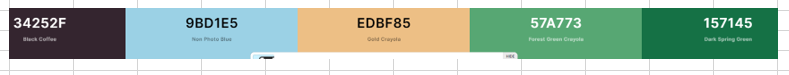

This is a visual image site. Displaying images of area in Co wicklow and Connemara.
Primary goal of the site for practice to set up responsive images and gallery’s that makes for a good user experience with good performance on the site. Focus is not specifically on the content but is on my own learning experiences.

## **To open any links in a new tab, please press Ctrl + click**

## Table of Contents

- [UX](#ux)
  - [External User Goals](#external-user-goals)
  - [Site Owner Goals](#site-owner-goals)
  - [Strategy and Scope](#strategy-and-scope)
  - [Structure](#structure-of-the-website)
  - [Wireframes](#wireframes)
  - [Surface](#surface)
    - [Colors](#colors)
    - [Typography](#typography)
    - [Images](#images)
    - [Features](#features)
- [Technologies](#technologies-used)
- [Testing](#testing)
  - [Functionality testing](#functionality-testing)
  - [Compatibility testing](#compatibility-testing)
  - [User stories testing](#user-stories-testing)
  - [Issues found during site development](#issues-during-development)
  - [Bugs](#bugs)
  - [Performance and Accessibility testing](#performance-and-accessibility-testing)
  - [Code Validation](#code-validation)
- [Deployment](#deployment)
- [Credits](#credits)

---

## UX

### External User goals

As a prospective user, I want to
- View Images on different screen sizes
- Use scrollable and/pr clickable images

### Site Owner goals

#### As site owner I want
- To provide a site that is easy to use and navigate, and can be viewed on different screen sizes.
- The user to enjoy viewing the images.
- Learn and provide different ways of displaying images.

### Strategy and scope
Looking at both strategy and scope of the project, I referred back to the user stories, which helped in planning out the project.
Colours and interesting info for my site, I listed out the opportunities/problems and how each of these might be addressed. And for the scope plane, I planned out the content and functional requirements.
As this project was a personal one to aid my learning, I focused on the objectives, of learning and planning out image layouts

### Structure of the website

The structure of the site is designed so that on landing on the site, the user can easily scroll through some images or alternatively use the nav bar included to navigate to the second page to view more images.

### Wireframes

These were built using balsamiq.

[Wireframe Mobile](readme-assets/images-site-wireframe.pdf)

### Surface

#### Colors

#### Typography

I planned to use Exo2 and Poppins fonts. This did not change during development as the fonts suited the site from a visual perspective.

#### Images
All images used on the site are my own. I wanted to use images of my local area and of holidays in Ireland I have been on

[Back to table of contents](#table-of-contents)

## Features

The site consists of

**_Website has the following features_**

### Landing Page

Contains the following:

### Navigation Menu

- Contains links to the Carousel Page and Home PAge

### Carousel/Gallery Page

Contains the following:

- Navigation menu
- Medium Screens: Images which are enlarged when the user hovers over them
- for smaller screens, I needed to change layout to columns and add figcaptions, as the layout for larger screens did not suit mobile size

### Future Features
- favicon
- 404 page
- pop up boves with more info on the locations in the images.

[Back to table of contents](#table-of-contents)

## Technologies Used

- HTML5 - Programming language for structuring the site.
- CSS3- Style sheet programming language
- [Bootstrap](https://getbootstrap.com/docs/4.6/getting-started/introduction/) Use as a framework for layout and responsiveness.
- [Font Awesome](https://fontawesome.com/) -used to provide icons across the site.
- [Google fonts](https://fonts.google.com/) -used to select and provide typography.
- [Github](https://github.com/)- software hosting platform to keep project in a remote location
- [Gitpod](https://gitpod.io/) - a development hosting platform
- Git - used for version-control.
- [Balsamiq](https://balsamiq.com/) - used to build wireframes. Downloaded software to use.
- Chrome Dev Tools - used to view responsiveness and layout as site was being developed. I found this very useful when developing the site, as it aided my learning throughout the project.
- Unicorn revealer extension was helpful when developing the site
- WAVE extension for reviewing accessibility and colour contrasts in testing.
- tinyjpg
- Validators:
  - jshint
  - validator.w3.org
  - jigsaw.w3.org/css-validator

[Back to table of contents](#table-of-contents)

## Testing

Testing Plan:
For each change/bug resolved, test the feature to ensure working as expected
Once development finished, re-do tests. Re run tests and update below/bugs/issues as needed.
Final changes made, then re-run code through validators, lighthosue and WAVE reports. click through all features and note if any further issues arise. Check responsiveness on different screen sizes
Testing issues and resolutions are noted below under feature tests, ussues during development and ib the bugs section.
Validation of code was re-checked each time a change was made, after the main development was done. Any issues resolved and tests re-run. Wave tests helped identify issues early so taht they could be corrected and feature/functions re-tested.
1. Validate css, html and javascript.
2. Lighthouse reports
3. WAVE accessibility reports
4. Cross brower testing

- Manual testing.
  - Functionality: test each feature on each page. Negative and positive cases.
  - Review already resolved bugs and test again.
  - User stories testing

- Any changes made, re-run all steps and note any issues

### Functionality Testing

#### Landing-Page

##### Feature: Nav Bar
- Expected: Displayed at top of page even when user scrolls down. Home page and clicking on carousel link, brings user to 2nd page
- Tested by: viewing page on different screen sizes and clicking on links.
- Result: No issues worked as expected

##### Feature: Images, with parrallax effect on scroll

- Expected: Scroll through images, imgs fixed until next displayed
- Testing: viewing page and scrolling on different screen sizes
- Result: No issues worked as expected

#### Learn More-Page
Expected: 
Tested by

##### Feature: NavBar

- Expected: Displayed at top of page even when user scrolls down. Home page and clicking on carousel link, brings user to home page
- Tested by: viewing page on different screen sizes and clicking on links.
- Result: No issues worked as expected

##### Feature: Gallery Carousel on large screens

- Expected: Images shown side by side but not fully visible until user hovers. At which point, image will move slightly and enlarge for full viewing
- Tested by: viewing carousel  and hovering over images.
- Result: No issues worked as expected

##### Feature: Gallery Carousel on screens under 768px:
- Expected: Images shown in 2 columns with text beneath
- Tested by: viewing carousel on different device sizes and scrolling through the page.
- Result: No issues worked as expected

##### Feature: Gallery Carousel on screens under 600px:
- Expected: Images shown in 1 columns with text beneath
- Tested by: viewing carousel on different device sizes and scrolling through the page.
- Result: No issues worked as expected

### Compatibility Testing

Tested on chrome. No issues.

[Back to table of contents](#table-of-contents)

### Issues during development

- I tried a number of different layouts, experimenting with bootstrap, flexbox and grid. Issues mainly arose due to my understanding of each of these. The aim of the project was to increase my knowledge and understanding, I would try to understand why each wouldn't work as expected, and then decided on final layouts.

[Back to table of contents](#table-of-contents)

### Bugs

- Home pages images not displaying on live site. 
    - This was corrected. Images are set as background images to achieve the parallax effect. The file path is set within the css folder. Removed assets/ and replaced with ..
    - This corrected the issue
- Link to more photos page, not working on love site on different screen sizes. Retyped links. And retested. Working now

- Validation errors on carousel.html
  - Three stray figure end tag: Removed tags and retested. No issues
  - Figure element not allowed as a child of a div. Replaced these divs with sections. Retested. No issues.

  - Figcaption not showing under one image. Tried increasing height of columns. Resolved for one image, not for the other. Image will need to be resized.
    - Resolved: Image resizing did not work. Increased height of column and added padding bottom to the figure element for image "glen of the downs"

### Performance and accessibility Testing

#### Lighthouse testing

#### Accessibility

### Code Validation

- css code: no Errors
- index.html: no Errors
- carousel.html: Errors documented in bugs section. Resolved. Warnings left as section has no heading elements.

[Back to table of contents](#table-of-contents)

## Deployment

The project was deployed to GitHub pages using the following steps:

1. Log into GitHub and select the repo.
2. Go to settings
3. Select Pages from vertical menu on left
4. On Source, select Master Branch and click save.
5. Website is now live and the URL will be displayed. [Link to live site]
6. When updates are commited and pushed to GitHub, live site will be updated.

To download and run locally, follow the below steps:

1. Log into GitHub and select the repository, fun-space-quiz
2. Select Code
3. Click Download Zip
4. Once files have downloaded, you can extract and useclone-project.png locally.

To Clone, follow the below steps:

1. Log into GitHub and select the repository, fun-space-quiz
2. Select Code
3. Click https and copy the link
4. Open git bash
5. Change the working directory to where you want the cloned directory
6. Use command git clone and the copied URL
7. Press enter

Select this file for screenshot [readme-assets/clone-repo.PNG]

Forking the repository:

1. Log into GitHub and select the repository, fun-space-quiz
2. Select Fork on top right hand corner.
3. A copy should be created in your github profile and pull requests submitted.

GitHub docs link [Forking a repository](https://docs.github.com/en/desktop/contributing-and-collaborating-using-github-desktop/cloning-and-forking-repositories-from-github-desktop#forking-a-repository/)

## Credits

- Help with code for parallax scolling effect: Tutorial geeks for geeks.org
- credit css-tricks card carousel for inspiration and help (to add in link)

### Media

#### Images Used

Images are all my own.

#### Other
None

### Content

None

### Colours

I used cooler.co to select inital colours. 

### Code

### Acknowledgements

I referred to the following to add to my knowledge and for help.

- [Bootstrap documentation](https://getbootstrap.com/docs/4.5/getting-started/introduction/)
- Code Institute course material, 
- [w3schools.com](https://www.w3schools.com)

[Back to table of contents](#table-of-contents)

This site was developed for Educational purposes